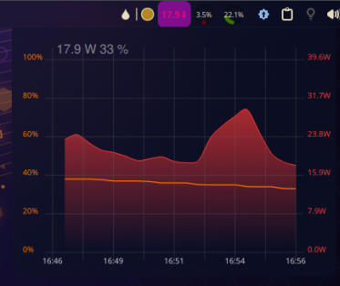
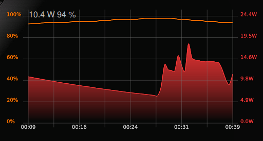
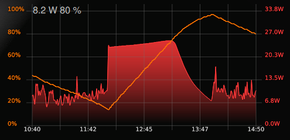
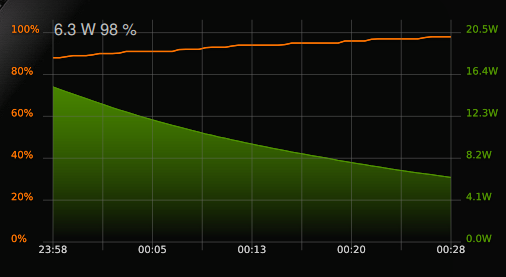
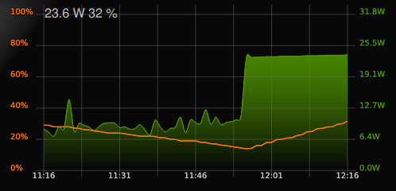

This Plasma 5 extensions allow you to monitor the current consumption and capacity of the battery (orange line = capacity of battery, red = consumption). Extension displays the data graphically. It is possible to set the number of samples per minute (1-60: e.g. 5 = 5x per minute plot values to graph) and time range of displayed data (10 - 600 minute). Color of graph and label on panel automatically changes (green when battery is charging and red for discharging). This widget can be added to the panel, but I do not recommend adding it to the system tray. The displayed consumption is the total consumption of all batteries in the system.

Available on KDE store: https://store.kde.org/p/1570454/

## In Panel

    

## Discharging

    
    

## Charging

    
    

## Author
* Martin Krčma
